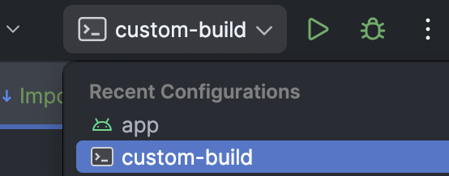

# Building with Android Studio

- Make sure you first [Import](Importing.md) and [Configure](Configuration.md) the project.
- Download and install [Android Studio](https://developer.android.com/studio).
- Open the downloaded/cloned folder in Android Studio.
- Change the run configuration in Android Studio from `app` to `custom-build` and press Run. 
- Build output will be located in `custom_build/build_output`.
