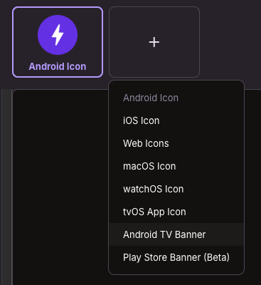

# Configure a custom build

- Fill in all required values in the `custom_build/config/custom.properties` file.
- Add your [artwork](#artwork) - icons, TV banner, and optionally start screen art.
- Set up [signing](#keystore-and-signing).
- Optionally: you can run `./build.sh -v` inside the `custom_build` folder to verify all required config values and files are in place.

Configuration is split in two, by whether it's safe to commit:

| File | Contents | Committed |
| --- | --- | --- |
| `config/custom.properties` | app name, package name, version, Property id | Yes - this is your build's identity, worth tracking |
| `config/signing.properties` | keystore location and passwords | **Never** - git-ignored |

## Artwork

Everything the build copies into the app lives in the `/config` folder, alongside
`custom.properties`:

| Path | What it is |
| --- | --- |
| `android/res/` | Launcher icons - IconKitchen's `android` output |
| `androidtv/res/` | The Android TV home screen banner - IconKitchen's `androidtv` output |
| `android/res/drawable-xxhdpi/start_screen_background`<br>`android/res/drawable-xxhdpi/start_screen_logo` | Optional [start screen art](#start-screen) |

### Icons

Use [IconKitchen](https://icon.kitchen) to create your app icon and place the `android` and
`androidtv` folders you get from IconKitchen in the `/config` folder here.  

<details>
<summary>
Make sure you set IconKitchen to also create an `Android TV Banner`.

`iOS` and `Web` are not needed, you can remove those.
</summary>

</details>

### Start screen

Only relevant when `DEFAULT_PROPERTY_ID` is set. The app then opens on a sign-in screen for that
Property rather than the Discover grid, and that screen has a background and a logo of its own.

Drop them in as `start_screen_background` and `start_screen_logo` under
`android/res/drawable-xxhdpi/` - anything Android can decode works, so `.jpg` for the background
and `.png` for a logo with transparency. They're copied along with the icons, since the build
takes the whole `android/res` tree.

The app ships blank placeholders for both, so leaving them out is fine - the screen simply shows
no artwork. And if the Property has its own start screen art configured in Content Studio, that
wins over whatever you put here.

## Keystore and Signing

### Just trying it out?

Skip this section. With no signing configuration, the build signs with the Android debug key,
warns you, and asks for confirmation. The result installs and runs fine for local testing.

It can never be published, though: Google Play rejects debug-signed uploads, and because Android
identifies an app by its signing key, a debug-signed install can't later be updated by a properly
signed one. Set up a real key before you ship anything.

### Generate a Keystore

The easiest way to create a keystore is through
`Android Studio`, [using these steps](https://developer.android.com/studio/publish/app-signing#generate-key).

If you'd rather use the command line, you can use the `keytool` command that comes with the JDK:  
`keytool -genkey -v -keystore <keystore_name>.keystore -alias <alias_name> -keyalg RSA -keysize 2048 -validity 10000`

For more information on how to use `keytool`, refer to
the [official documentation](https://docs.oracle.com/javase/6/docs/technotes/tools/windows/keytool.html).

### Configure the Keystore

Copy the template - the copy is git-ignored:

```
cd custom_build/config
cp signing.properties.template signing.properties
```

Then point it at your key and set the alias:

```
KEYSTORE_FILE=~/keys/acme-release.jks
KEYSTORE_ALIAS=acme
```

**Keep the keystore outside the repo.** A path like `~/keys/` means the key physically cannot be
committed, which is a stronger guarantee than remembering not to `git add` it. If you'd rather
keep it in `config/`, that works too - `*.keystore` and `*.jks` are git-ignored there, and the
build picks up the first one it finds. Use only one, or the choice is arbitrary.

### Passwords

Leave `KEYSTORE_PASSWORD` blank and the build prompts for it, so no password is written to disk
at all. Fill it in if you'd rather not be prompted on every build - `signing.properties` is
git-ignored either way. `KEYSTORE_ALIAS_PASSWORD` is only needed when your alias password differs
from the keystore password.

### If your key is already committed

`.gitignore` only protects files that were never added, so a key committed before these rules
existed stays tracked. `build.sh` refuses to build in that case and tells you how to fix it:

```
git rm --cached <path-to-keystore>
```

If it was already pushed, treat the key as compromised: anyone with the repo can ship updates
that Android will accept as genuine. Generate a new one and republish under it.
