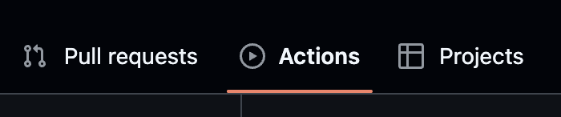
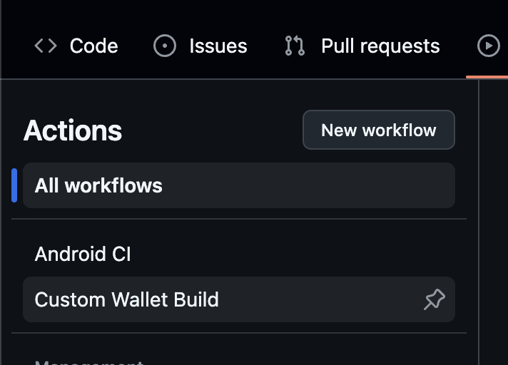
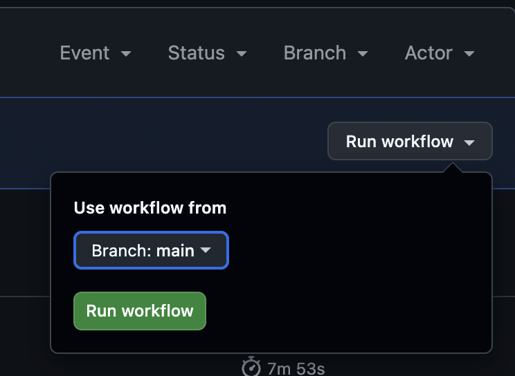
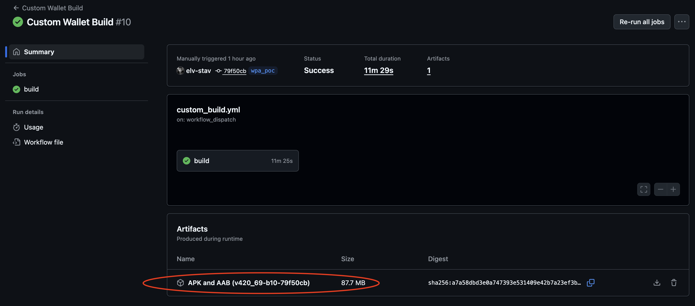

# Building with Github Actions

- Make sure you first [Import](Importing.md) and [Configure](Configuration.md) the project.
- Go to your imported repository page and click `Actions`  
  
- Click `Custom Wallet Build`  
  
- Click `Run Workflow` on the right and select the branch you pushed your configuration to, then click the green `Run Workflow` button  
  
- Once your build is complete, you can download a zip with the APK / AAB files here:  
  
