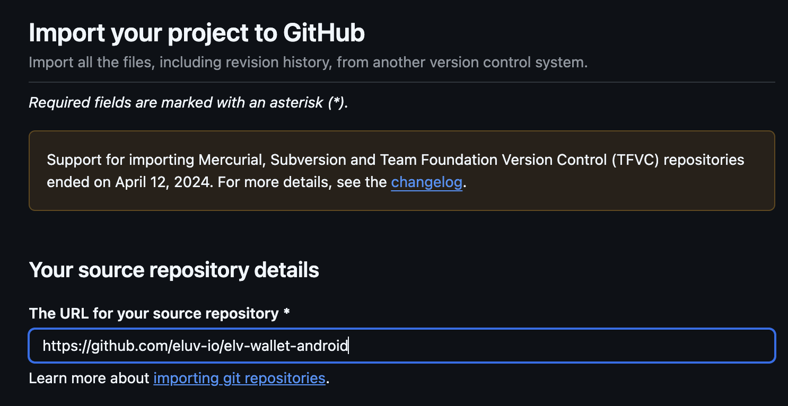
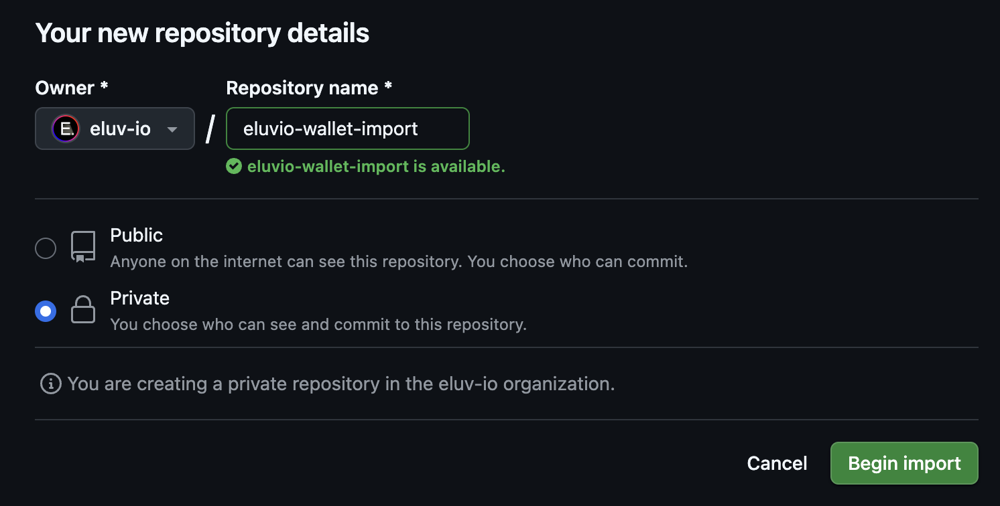

### Import the project
First, create a private clone of the repo.  
Do **not** use GitHub's "fork" functionality, because forks cannot be made private.  
Instead, create a [new import](https://github.com/new/import) and for the source URL enter:  
`https://github.com/eluv-io/elv-wallet-android`

See screenshot

 

Choose an owner (your organization) and their repo name, and make sure to set the visibility to private.

See screenshot

 

After GitHub is done creating the import for you, clone the repo to your local machine (see [Cloning a repository](https://docs.github.com/en/repositories/creating-and-managing-repositories/cloning-a-repository)). 
