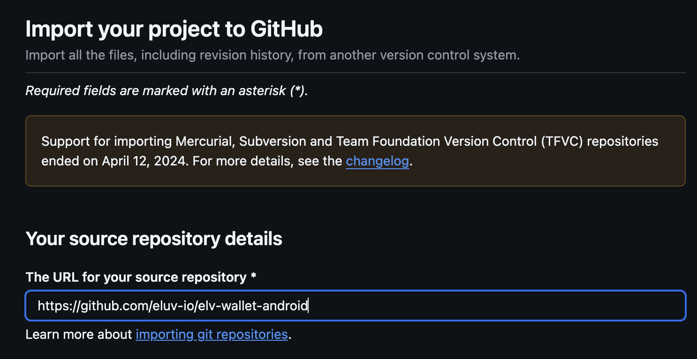
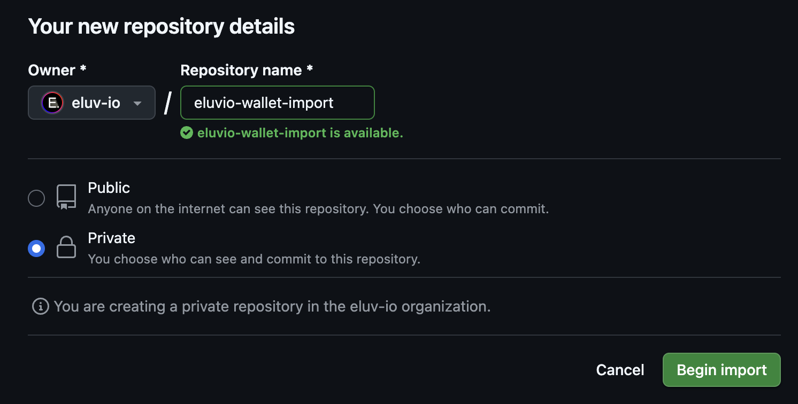

# Importing the project

[Fork](https://docs.github.com/en/pull-requests/collaborating-with-pull-requests/working-with-forks/fork-a-repo)
and [clone](https://docs.github.com/en/repositories/creating-and-managing-repositories/cloning-a-repository)
this repo, or just clone it directly if you don't plan to push anything back.

Builds run on your own machine, so nothing secret ever needs to reach GitHub. Your keystore and
its passwords are git-ignored (see [Configuration](Configuration.md#keystore-and-signing)) and
stay on the machine that builds.

Everything else - your app name, package name, icons, and the Property your app opens on - is
ordinary configuration. Committing it is a good idea: it's how you reproduce the same build later
and how you pick up future code updates from Eluvio by merging.

A fork of a public repo can't be made private, so if you'd rather keep your branding
configuration out of public view, create a [new import](https://github.com/new/import) instead of
a fork, with the source URL:

`https://github.com/eluv-io/elv-wallet-android`

See screenshot

 

Choose an owner (your organization) and their repo name, and set the visibility to private.

See screenshot

 

Then clone it to your machine (see
[Cloning a repository](https://docs.github.com/en/repositories/creating-and-managing-repositories/cloning-a-repository)).
